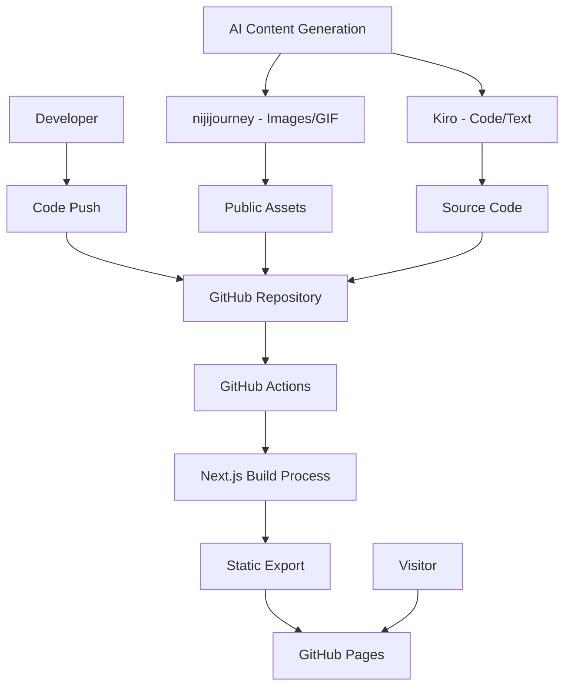

# Design Document: 2026年版年賀状サイト

## Overview

2026年版年賀状サイトは、Next.js 14+のApp Routerを活用したモダンな静的サイトです。最新のAI技術（nijijourney、Kiro等）を使用してコンテンツを生成し、GitHub Pagesで自動デプロイされます。レスポンシブデザインとアクセシビリティを重視し、高いパフォーマンスを実現します。

## Architecture

### システム構成



### 技術スタック

- **フレームワーク**: Next.js 16+ (App Router)
- **言語**: TypeScript
- **スタイリング**: Tailwind CSS
- **デプロイメント**: GitHub Pages (静的エクスポート)
- **CI/CD**: GitHub Actions
- **AI技術**: nijijourney (画像生成)、Kiro (コード生成)

## Components and Interfaces

### コンポーネント構造

```
app/
├── layout.tsx          # ルートレイアウト
├── page.tsx           # メインページ
├── globals.css        # グローバルスタイル
└── components/
    ├── Header.tsx     # ヘッダーコンポーネント
    ├── Footer.tsx     # フッターコンポーネント
    ├── HeroSection.tsx # メインビジュアルセクション
    ├── ConceptSection.tsx # コンセプト紹介セクション
    ├── TechnologySection.tsx # 技術紹介セクション
    └── TechnologyCard.tsx # 技術カード
```

### インターフェース定義

```typescript
// types/index.ts
export interface Technology {
  id: string;
  name: string;
  description: string;
  logoPath: string;
  officialUrl: string;
  usage: string; // サイト作成での活用方法
}

export interface SiteConfig {
  year: number;
  conceptTheme: string;
  greeting: {
    japanese: string;
  };
  author: string;
  technologies: Technology[];
}

export interface ResponsiveBreakpoints {
  mobile: string;
  tablet: string;
  desktop: string;
  large: string;
}
```

### コンポーネント仕様

#### HeroSection
- メインビジュアル（AI生成GIF）の表示
- 2026年新年挨拶メッセージ
- レスポンシブ対応のテキストサイズ調整

#### ConceptSection
- 2026年のコンセプトテーマ説明
- 日本語での説明文
- 視覚的に魅力的なレイアウト

#### TechnologySection
- 使用したAI技術の紹介
- グリッドレイアウトでの技術カード表示
- レスポンシブ対応（1-4列の可変グリッド）

#### TechnologyCard
- 技術ロゴ、名前、説明の表示
- 公式サイトへの外部リンク
- ホバーエフェクトとアクセシビリティ対応
- 公式サイトへの外部リンク
- ホバーエフェクトとアクセシビリティ対応

## Data Models

### 設定データ構造

```typescript
// config/siteConfig.ts
export const siteConfig: SiteConfig = {
  year: 2026,
  conceptTheme: "Specification", // 2026年のテーマ
  greeting: {
    japanese: "謹んで新春のお慶びを申し上げます。\n旧年中は格別のご厚情を賜り、誠にありがとうございました。\n本年も相変わらずのご指導ご鞭撻を賜りますよう、心よりお願い申し上げます。"
  },
  author: "Toshiyuki",
  technologies: [
    {
      id: "nextjs",
      name: "Next.js",
      description: "This web page utilizes Next.js 14+ with App Router for its frontend. Optimized for static export and GitHub Pages deployment.",
      logoPath: "/nextjs_logo.png",
      officialUrl: "https://nextjs.org/",
      usage: "Frontend framework with static export capabilities"
    },
    {
      id: "nijijourney",
      name: "nijijourney",
      description: "All visual content including GIFs and videos is created using nijijourney, which specializes in anime-style image generation. It can generate high-quality animation-style visuals.",
      logoPath: "/nijijourney_logo.jpg",
      officialUrl: "https://nijijourney.com/",
      usage: "Anime-style AI-generated visual content"
    },
    {
      id: "kiro",
      name: "Kiro",
      description: "All code on this website is written with assistance from Kiro. As an AI-powered IDE, it helped create optimized, accessible code with advanced reasoning capabilities. Particularly, the Spec Coding feature enables a systematic development process from requirements definition to design and implementation.",
      logoPath: "/kiro_logo.png",
      officialUrl: "https://kiro.dev",
      usage: "AI-powered IDE with Spec Coding and optimization"
    },
    {
      id: "github-pages",
      name: "GitHub Pages",
      description: "This website is hosted on GitHub Pages and is automatically built and deployed using GitHub Actions with Next.js static export.",
      logoPath: "/github_pages_logo.png",
      officialUrl: "https://pages.github.com/",
      usage: "Static site hosting with automated CI/CD pipeline"
    }
  ]
};
```

### レスポンシブ設定

```typescript
// config/responsive.ts
export const breakpoints: ResponsiveBreakpoints = {
  mobile: "sm:text-xs md:text-base",
  tablet: "md:text-base lg:text-lg",
  desktop: "lg:text-lg xl:text-xl",
  large: "xl:text-xl 2xl:text-2xl"
};

export const gridConfig = {
  mobile: "grid-cols-1",
  tablet: "sm:grid-cols-2",
  desktop: "md:grid-cols-3 lg:grid-cols-4",
  gap: "gap-8"
};
```

## Correctness Properties

*プロパティとは、システムの全ての有効な実行において真であるべき特性や動作のことです。プロパティは、人間が読める仕様と機械で検証可能な正確性保証の橋渡しとなります。*

### Property 1: 新年挨拶メッセージの表示
*全ての* サイト訪問時において、2026年の新年挨拶メッセージがページに表示されるべきです
**Validates: Requirements 1.1**

### Property 2: コンセプトテーマの表示
*全ての* サイト読み込み時において、2026年のコンセプトテーマが明確に表示されるべきです
**Validates: Requirements 1.2**

### Property 3: 日本語挨拶の提供
*全ての* サイト表示において、日本語の新年挨拶が含まれるべきです
**Validates: Requirements 1.3**

### Property 4: メインビジュアルの表示
*全ての* サイト表示において、視覚的に魅力的なメインビジュアル（画像またはGIF）が表示されるべきです
**Validates: Requirements 1.4**

### Property 5: AI技術一覧の表示
*全ての* 技術セクション表示において、使用したAI技術の一覧が表示されるべきです
**Validates: Requirements 2.1**

### Property 6: 技術カード情報の完全性
*全ての* 技術カードにおいて、ロゴ、名前、説明、公式リンクが含まれるべきです
**Validates: Requirements 2.2, 2.3**

### Property 7: 外部リンクの新タブ表示
*全ての* 技術リンクにおいて、クリック時に新しいタブで公式サイトが開かれるべきです
**Validates: Requirements 2.4**

### Property 8: レスポンシブレイアウトの適用
*全ての* デバイスサイズ（モバイル、タブレット、デスクトップ）において、適切に最適化されたレイアウトが表示されるべきです
**Validates: Requirements 3.1, 3.2, 3.3, 3.4**

### Property 9: 静的エクスポート設定の正確性
*全ての* アセット参照において、正しいベースパスが使用されるべきです
**Validates: Requirements 4.3**

### Property 10: React関数コンポーネントの使用
*全ての* コンポーネントにおいて、React関数コンポーネントとして実装されるべきです
**Validates: Requirements 5.4**

### Property 11: 画像最適化の活用
*全ての* 画像表示において、適切な画像フォーマットと最適化が適用されるべきです
**Validates: Requirements 5.5, 6.2**

### Property 12: フッター情報の完全性
*全ての* ページにおいて、フッターに2026年の著作権表示と作成者名が含まれるべきです
**Validates: Requirements 7.1, 7.2, 7.3**

### Property 13: アクセシビリティ属性の完全性
*全ての* 画像とリンクにおいて、適切なalt属性と説明的なテキストが提供されるべきです
**Validates: Requirements 8.1, 8.2, 8.4**

## Error Handling

### エラー処理戦略

1. **画像読み込みエラー**
   - 画像が読み込めない場合のフォールバック表示
   - alt属性による代替テキストの提供
   - 適切なエラーメッセージの表示

2. **外部リンクエラー**
   - 外部サイトへのリンクが無効な場合の処理
   - ユーザーへの適切な通知
   - リンクの有効性チェック

3. **レスポンシブレイアウトエラー**
   - 予期しない画面サイズでの表示崩れ防止
   - 最小・最大幅の設定
   - フレキシブルなレイアウト設計

4. **静的エクスポートエラー**
   - ベースパス設定の不備による404エラー防止
   - アセットパスの動的生成
   - 開発環境と本番環境の差異対応

### エラー境界の実装

```typescript
// components/ErrorBoundary.tsx
export class ErrorBoundary extends React.Component {
  // エラー発生時のフォールバックUI表示
  // 開発環境でのエラー詳細表示
  // 本番環境での適切なエラーメッセージ
}
```

## Testing Strategy

### デュアルテストアプローチ

本プロジェクトでは、包括的なカバレッジを実現するために、ユニットテストとプロパティベーステストの両方を実装します：

- **ユニットテスト**: 特定の例、エッジケース、エラー条件を検証
- **プロパティテスト**: 全ての入力に対する普遍的なプロパティを検証
- 両方のテストは相補的であり、包括的なカバレッジに必要です

### プロパティベーステスト設定

- **テストライブラリ**: fast-check (JavaScript/TypeScript用)
- **最小実行回数**: 各プロパティテストあたり100回の反復
- **タグ形式**: **Feature: new-year-2026, Property {number}: {property_text}**
- 各正確性プロパティは単一のプロパティベーステストで実装される必要があります

### ユニットテストバランス

- ユニットテストは特定の例とエッジケースに焦点を当てる
- プロパティベーステストが多くの入力をカバーするため、過度なユニットテストは避ける
- ユニットテストの焦点：
  - 正しい動作を示す特定の例
  - コンポーネント間の統合ポイント
  - エッジケースとエラー条件
- プロパティテストの焦点：
  - 全ての入力に対して成り立つ普遍的なプロパティ
  - ランダム化による包括的な入力カバレッジ

### テスト実装例

```typescript
// __tests__/properties/hero-section.test.ts
import fc from 'fast-check';

describe('HeroSection Properties', () => {
  test('Property 1: 新年挨拶メッセージの表示', () => {
    // Feature: new-year-2026, Property 1: 新年挨拶メッセージの表示
    fc.assert(fc.property(
      fc.record({
        year: fc.constant(2026),
        greeting: fc.string()
      }),
      (config) => {
        const component = render(<HeroSection config={config} />);
        expect(component.getByText(/2026/)).toBeInTheDocument();
        expect(component.getByText(/新年/)).toBeInTheDocument();
      }
    ), { numRuns: 100 });
  });
});
```

### テストカバレッジ目標

- **コンポーネントテスト**: 全てのReactコンポーネントの動作検証
- **統合テスト**: コンポーネント間の相互作用テスト
- **アクセシビリティテスト**: WCAG準拠の検証
- **レスポンシブテスト**: 各ブレークポイントでの表示確認
- **パフォーマンステスト**: 読み込み時間とバンドルサイズの監視